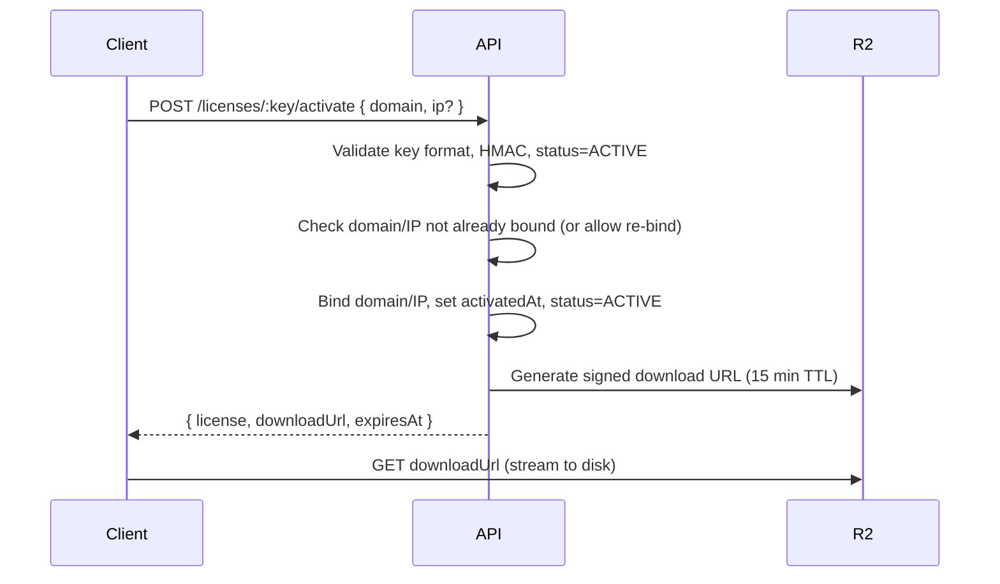

# Security Plan — Source Code Marketplace

> **Phase 0 Deliverable** — Bảo mật ứng dụng, license, chống rò rỉ source code
> **Tuân thủ**: OWASP Top 10 2021, OWASP ASVS Level 2, GDPR/PDPA basics

---

## 1. Threat Model (STRIDE)

| Threat | Impact | Likelihood | Mitigation |
|--------|--------|------------|------------|
| **Spoofing** | Account takeover, fake orders | Medium | MFA, rate-limited auth, JWT short expiry, device fingerprinting |
| **Tampering** | License bypass, price manipulation | High | Signed JWT, idempotency keys, webhook signatures, DB constraints |
| **Repudiation** | Denied purchases, chargebacks | Medium | Immutable audit logs, signed webhooks, email confirmations |
| **Info Disclosure** | Source code leak, PII exposure | Critical | R2 signed URLs (15min TTL), watermarking, encryption at rest, RBAC |
| **DoS** | API overload, payment DoS | Medium | Rate limiting (Per IP/User), WAF, auto-scaling, circuit breakers |
| **Elevation of Privilege** | Customer → Admin, horizontal access | High | RBAC middleware, permission checks per endpoint, admin impersonation audit |

---

## 2. Authentication & Session Security

### 2.1 User Authentication (NextAuth.js v5)

```typescript
// apps/web/src/auth/config.ts
export const authConfig = {
  providers: [
    CredentialsProvider({
      name: 'credentials',
      credentials: { email: {}, password: {} },
      authorize: async (creds) => {
        const user = await validateUser(creds.email, creds.password)
        if (!user) throw new Error('Invalid credentials')
        // Check 2FA if enabled
        if (user.twoFactorEnabled) {
          return { ...user, requires2FA: true }
        }
        return user
      }
    }),
    GoogleProvider({ clientId, clientSecret }),
    GitHubProvider({ clientId, clientSecret })
  ],
  session: { strategy: 'jwt', maxAge: 15 * 60 }, // 15 min access
  jwt: {
    maxAge: 7 * 24 * 60 * 60,        // 7 day refresh
    secret: env.NEXTAUTH_SECRET,      // 32+ char random
  },
  callbacks: {
    async jwt({ token, user, trigger, session }) {
      if (user) { token.id = user.id; token.role = user.role; token.2fa = user.twoFactorEnabled }
      if (trigger === 'update') { token.name = session.name; token.email = session.email }
      return token
    },
    async session({ session, token }) {
      session.user.id = token.id
      session.user.role = token.role
      session.user.twoFactorEnabled = token.2fa
      return session
    }
  },
  pages: {
    signIn: '/auth/login',
    error: '/auth/login',
    newUser: '/dashboard'
  },
  events: {
    async signIn({ user, isNewUser }) { await logAudit(user.id, 'LOGIN', 'User', user.id) },
    async signOut({ token }) { await logAudit(token.id, 'LOGOUT', 'User', token.id) }
  }
}
```

### 2.2 Token Strategy

| Token | TTL | Storage | Rotation |
|-------|-----|---------|----------|
| Access Token (JWT) | 15 min | Memory (React state) | Auto-refresh via `/auth/refresh` |
| Refresh Token | 7 days | HttpOnly Secure Cookie (SameSite=Lax) | Rotate on use, revoke on logout/password change |
| Email Verify Token | 24 hours | DB (hashed) | Single use |
| Password Reset Token | 1 hour | DB (hashed) | Single use |
| License Activation Token | 10 min | DB | Single use |

### 2.3 Password Policy

- Min 12 chars, max 128
- Require: uppercase, lowercase, number, special char
- Bcrypt cost: 12 (adjust per CPU benchmark)
- Breach check: HaveIBeenPwned API (k-anonymity)
- Block common passwords (top 10k)

### 2.4 Multi-Factor Authentication (Phase 3+)

- TOTP (RFC 6238) via `otplib`
- Backup codes (10, single-use)
- Enforced for Admin roles (Phase 3)
- Optional for Customers (Phase 3+)

### 2.5 Session Security

```typescript
// Middleware: apps/web/src/middleware.ts
export const config = { matcher: ['/dashboard/:path*', '/admin/:path*'] }

export default async function middleware(req: NextRequest) {
  const token = await getToken({ req, secret: env.NEXTAUTH_SECRET })
  if (!token) return redirectToLogin(req)
  
  // Role check for admin routes
  if (req.nextUrl.pathname.startsWith('/admin') && token.role !== 'SUPER_ADMIN' && token.role !== 'ADMIN') {
    return NextResponse.redirect(new URL('/403', req.url))
  }
  
  // CSRF for state-changing (NextAuth handles via callbackUrl)
  return NextResponse.next()
}
```

---

## 3. API Security (NestJS)

### 3.1 Global Guards & Interceptors

```typescript
// apps/api/src/common/guards/
@Module({...})
export class AppModule {
  configure(consumer: MiddlewareConsumer) {
    consumer
      .apply(HelmetMiddleware)      // Security headers
      .apply(RateLimitMiddleware)   // Global rate limit
      .apply(CorrelationIdMiddleware) // Request tracing
      .forRoutes('*')
  }
}

@Global()
@Module({
  providers: [
    { provide: APP_GUARD, useClass: ThrottlerGuard },      // Rate limiting
    { provide: APP_GUARD, useClass: JwtAuthGuard },         // JWT validation
    { provide: APP_GUARD, useClass: RolesGuard },           // RBAC
    { provide: APP_INTERCEPTOR, useClass: TransformInterceptor }, // Response envelope
    { provide: APP_INTERCEPTOR, useClass: AuditInterceptor },    // Auto-audit
    { provide: APP_FILTER, useClass: AllExceptionsFilter }   // Error handling
  ]
})
export class CoreModule {}
```

### 3.2 Rate Limiting

| Endpoint Group | Limit | Window | Key |
|----------------|-------|--------|-----|
| Auth (login, register, reset) | 5 req | 1 min | IP |
| License activate | 10 req | 1 min | IP + User |
| License download | 5 req | 1 min | User |
| Payment webhook | 100 req | 1 min | IP (validated) |
| API (general) | 100 req | 1 min | User |
| Admin (write) | 30 req | 1 min | User |

```typescript
// apps/api/src/common/guards/throttler.guard.ts
@Throttle({ default: { limit: 100, ttl: 60000 } })
export class ThrottlerGuard extends ThrottlerGuard {
  protected getTracker(req: Record<string, any>): string {
    const user = req.user?.id
    return user ? `user:${user}` : `ip:${req.ip}`
  }
}
```

### 3.3 Input Validation & Sanitization

- **Class-validator** + **class-transformer** on all DTOs
- **Zod** schemas for webhook payloads
- **DOMPurify** for rich text (TipTap output)
- File upload: MIME validation, magic bytes check, size limit (500MB source zip)
- SQL Injection: Prisma parameterized queries (default)

### 3.4 Security Headers (Helmet)

```typescript
// apps/api/src/common/middleware/helmet.middleware.ts
export function helmetMiddleware(req, res, next) {
  helmet({
    contentSecurityPolicy: {
      directives: {
        defaultSrc: ["'self'"],
        scriptSrc: ["'self'", "'unsafe-inline'", 'https://js.stripe.com'],
        styleSrc: ["'self'", "'unsafe-inline'", 'https://fonts.googleapis.com'],
        imgSrc: ["'self'", 'data:', 'https:', 'blob:'],
        fontSrc: ["'self'", 'https://fonts.gstatic.com'],
        connectSrc: ["'self'", 'https://api.stripe.com', 'https://api.payos.vn'],
        frameSrc: ["'self'", 'https://js.stripe.com', 'https://hooks.stripe.com'],
        objectSrc: ["'none'"],
        baseUri: ["'self'"],
        formAction: ["'self'"],
        frameAncestors: ["'none'"],
      }
    },
    hsts: { maxAge: 31536000, includeSubDomains: true, preload: true },
    referrerPolicy: { policy: 'strict-origin-when-cross-origin' },
    noSniff: true,
    xssFilter: true,
    frameguard: { action: 'deny' }
  })(req, res, next)
}
```

---

## 4. License Protection & Anti-Leak (Phase 5 Core)

### 4.1 License Key Format

```
LIC-{UUIDv7}-{HMAC-SHA256(32 chars)}
Example: LIC-0192f3a8-7b4c-7d8e-9f2a-1b3c4d5e6f7a-a1b2c3d4e5f67890123456789abcdef
```

- UUIDv7: timestamp-ordered, unique
- HMAC: `key = env.LICENSE_HMAC_SECRET`, `data = uuid + productId + licenseTypeId + userId`
- Verification: constant-time comparison

### 4.2 Activation Flow



### 4.3 Download Protection

```typescript
// apps/api/src/modules/licenses/licenses.service.ts
async generateDownloadUrl(licenseId: string, userId: string, versionId?: string) {
  const license = await this.licenseRepo.findOneOrFail({ 
    where: { id: licenseId, userId },
    relations: { product: true, licenseType: true }
  })
  
  // Checks
  if (license.status !== LicenseStatus.ACTIVE) throw new ForbiddenException('License not active')
  if (license.downloadCount >= license.maxDownloads) throw new ForbiddenException('Download limit reached')
  if (license.expiresAt && new Date() > license.expiresAt) throw new ForbiddenException('Support expired')
  
  // Select version
  const version = versionId 
    ? await this.versionRepo.findOne({ where: { id: versionId, productId: license.productId } })
    : await this.versionRepo.findLatest(license.productId)
  
  if (!version) throw new NotFoundException('Version not found')
  
  // Generate signed URL (R2)
  const signedUrl = await this.r2Service.getSignedDownloadUrl(
    version.fileUrl,     // R2 object key
    15 * 60,             // 15 min TTL
    license.key,         // Include license key in signed headers for audit
    userId
  )
  
  // Increment download count atomically
  await this.licenseRepo.increment({ id: licenseId }, 'downloadCount', 1)
  
  // Log download
  await this.downloadLogRepo.create({
    licenseId, userId, ipAddress: this.request.ip,
    fileUrl: version.fileUrl, fileVersion: version.version, success: true
  })
  
  return { downloadUrl: signedUrl, expiresAt: new Date(Date.now() + 15*60*1000), ... }
}
```

### 4.4 Watermarking (Source Code Fingerprinting)

**Strategy**: Multi-layer invisible watermark embedded at purchase time

| Layer | Technique | Detection |
|-------|-----------|-----------|
| **1. Metadata** | JSON comment at top of key files (`package.json`, `README.md`, main entry) | Easy extract |
| **2. Whitespace** | Trailing whitespace patterns in 50 random lines (binary encoding) | Survives minification |
| **3. AST Variable Renaming** | Consistent rename of 20 internal variables per license (using `@babel/parser`) | Survives reformatting |
| **4. Comment Fingerprints** | Unique UUID comments in 10 strategic locations | Survives most modifications |
| **5. Build-time Hash** | Inject `const __LICENSE_FINGERPRINT__ = "..."` in bundled output | Runtime detectable |

```typescript
// packages/watermark/src/watermarker.ts
export class SourceWatermarker {
  async embed(sourceZip: Buffer, licenseKey: string, userId: string): Promise<Buffer> {
    const watermarkData = this.generateWatermark(licenseKey, userId)
    const files = await this.extractZip(sourceZip)
    
    // Layer 1: Metadata injection
    this.injectMetadata(files, watermarkData)
    
    // Layer 2: Whitespace encoding
    this.encodeWhitespace(files, watermarkData.fingerprint)
    
    // Layer 3: AST-based variable rename (JS/TS only)
    this.renameVariables(files, watermarkData.renameMap)
    
    // Layer 4: Comment fingerprints
    this.injectComments(files, watermarkData.commentIds)
    
    // Layer 5: Build fingerprint (if build script detected)
    this.injectBuildFingerprint(files, watermarkData.buildHash)
    
    return this.createZip(files)
  }
  
  async detect(leakedZip: Buffer): Promise<{ licenseKey: string; userId: string; confidence: number } | null> {
    // Extract all layers, correlate, return match with confidence score
  }
}
```

**Watermark Payload** (encrypted, 256-bit):
```json
{
  "licenseKey": "LIC-0192f3a8...",
  "userId": "cm7x9k2z0000usr123",
  "productId": "cm7x9k2z0000prd123",
  "timestamp": 1720953600000,
  "fingerprint": "a1b2c3d4e5f6...",  // 128-bit random
  "renameMap": { "userService": "userService_a1b2", "authGuard": "authGuard_c3d4" },
  "commentIds": ["wm_cmt_1", "wm_cmt_2", ...],
  "buildHash": "sha256:..."
}
```

### 4.5 Domain/IP Binding Enforcement

```typescript
// Middleware on customer's app (provided as npm package @sourceban/license-client)
export function licenseGuard(options: LicenseOptions) {
  return async (req, res, next) => {
    const licenseKey = process.env.SOURCEBAN_LICENSE_KEY
    if (!licenseKey) return res.status(500).send('License not configured')
    
    const result = await fetch(`https://api.sourceban.dev/v1/licenses/${licenseKey}/verify`, {
      method: 'POST',
      headers: { 'Content-Type': 'application/json' },
      body: JSON.stringify({
        domain: req.hostname,
        ip: req.ip,
        timestamp: Date.now()
      })
    })
    
    if (!result.ok) {
      const error = await result.json()
      return res.status(403).render('license-error', { error })
    }
    
    next()
  }
}
```

**Server-side verification**:
```typescript
// apps/api/src/modules/licenses/licenses.controller.ts
@Post(':key/verify')
async verify(@Param('key') key: string, @Body() dto: VerifyDto) {
  const license = await this.licenseRepo.findOne({ where: { key }, relations: { product: true } })
  if (!license) throw new NotFoundException()
  
  // Check domain allowlist (license.domainLimit domains)
  const allowedDomains = license.allowedDomains || []
  if (allowedDomains.length > 0 && !allowedDomains.includes(dto.domain)) {
    if (allowedDomains.length >= license.domainLimit) {
      throw new ForbiddenException('Domain limit reached')
    }
    // Auto-add if under limit
    license.allowedDomains = [...allowedDomains, dto.domain]
    await this.licenseRepo.save(license)
  }
  
  // Check IP (optional)
  if (dto.ip && license.allowedIps && !license.allowedIps.includes(dto.ip)) {
    if (license.allowedIps.length < license.ipLimit) {
      license.allowedIps = [...license.allowedIps, dto.ip]
      await this.licenseRepo.save(license)
    } else {
      throw new ForbiddenException('IP limit reached')
    }
  }
  
  return { valid: true, product: license.product.name, expiresAt: license.expiresAt }
}
```

---

## 5. File Storage Security (Cloudflare R2)

### 5.1 Bucket Policy

```json
{
  "Version": "2012-10-17",
  "Statement": [
    {
      "Sid": "AllowSignedDownloadsOnly",
      "Effect": "Allow",
      "Principal": "*",
      "Action": "s3:GetObject",
      "Resource": "arn:aws:s3:::sourceban-files/*",
      "Condition": {
        "StringEquals": {
          "s3:ExistingObjectTag/license-verified": "true"
        }
      }
    },
    {
      "Sid": "DenyDirectAccess",
      "Effect": "Deny",
      "Principal": "*",
      "Action": ["s3:GetObject", "s3:ListBucket"],
      "Resource": ["arn:aws:s3:::sourceban-files", "arn:aws:s3:::sourceban-files/*"],
      "Condition": {
        "Bool": { "aws:SecureTransport": "false" }
      }
    }
  ]
}
```

### 5.2 Signed URL Generation (Server-side)

```typescript
// apps/api/src/modules/storage/r2.service.ts
@Injectable()
export class R2Service {
  private s3: S3Client
  private bucket = 'sourceban-files'
  
  async getSignedDownloadUrl(
    key: string, 
    ttlSeconds: number, 
    licenseKey: string,
    userId: string
  ): Promise<string> {
    const command = new GetObjectCommand({
      Bucket: this.bucket,
      Key: key,
      ResponseContentDisposition: `attachment; filename="${this.getFileName(key)}"`,
      // Custom headers for audit
      ResponseExpires: new Date(Date.now() + ttlSeconds * 1000)
    })
    
    const signedUrl = await getSignedUrl(this.s3, command, { expiresIn: ttlSeconds })
    
    // Log for audit
    await this.auditLog.create({
      action: 'DOWNLOAD_URL_GENERATED',
      entityType: 'License',
      entityId: licenseKey,
      userId,
      metadata: { key, ttlSeconds, ip: this.request.ip }
    })
    
    return signedUrl
  }
  
  async uploadSourceFile(file: Express.Multer.File, productId: string): Promise<string> {
    // 1. Scan for malware (ClamAV via Lambda/Container)
    await this.virusScan(file.buffer)
    
    // 2. Generate encrypted key path: products/{productId}/v{version}/{uuid}.zip.enc
    const key = `products/${productId}/v${version}/${uuid()}.zip.enc`
    
    // 3. Encrypt with AES-256-GCM (key from KMS/env)
    const encrypted = await this.encrypt(file.buffer)
    
    // 4. Upload with metadata tags
    await this.s3.send(new PutObjectCommand({
      Bucket: this.bucket,
      Key: key,
      Body: encrypted,
      ContentType: 'application/octet-stream',
      Tagging: 'license-verified=false',
      Metadata: {
        'original-name': file.originalname,
        'product-id': productId,
        'encrypted': 'true',
        'algorithm': 'AES-256-GCM'
      }
    }))
    
    return key
  }
}
```

### 5.3 Encryption at Rest

- **Algorithm**: AES-256-GCM (96-bit nonce, 128-bit tag)
- **Key Management**: Cloudflare Workers KV (or AWS KMS / HashiCorp Vault)
- **Key Rotation**: Annual, re-encrypt on access (lazy) or background job
- **File Integrity**: SHA-256 stored in DB, verified on download

---

## 6. Payment Security

### 6.1 Stripe (International)

```typescript
// apps/api/src/modules/payments/stripe.service.ts
@Injectable()
export class StripeService {
  private stripe = new Stripe(env.STRIPE_SECRET_KEY, { apiVersion: '2024-06-20' })
  
  async createPaymentIntent(order: Order, returnUrl: string) {
    const intent = await this.stripe.paymentIntents.create({
      amount: Math.round(order.total * 100), // VND no decimals
      currency: 'vnd',
      automatic_payment_methods: { enabled: true },
      metadata: {
        orderId: order.id,
        orderCode: order.code,
        userId: order.userId
      },
      receipt_email: order.user.email,
      shipping: { name: order.user.name, address: order.shippingAddress }
    })
    
    // Save payment record
    await this.paymentRepo.create({
      orderId: order.id,
      userId: order.userId,
      provider: PaymentMethod.STRIPE,
      providerRef: intent.id,
      amount: order.total,
      status: PaymentStatus.PENDING
    })
    
    return { clientSecret: intent.client_secret, paymentIntentId: intent.id }
  }
  
  // Webhook: verify signature
  async handleWebhook(payload: Buffer, signature: string) {
    let event: Stripe.Event
    try {
      event = this.stripe.webhooks.constructEvent(payload, signature, env.STRIPE_WEBHOOK_SECRET)
    } catch (e) {
      throw new BadRequestException('Invalid signature')
    }
    
    // Idempotency
    const processed = await this.processedWebhookRepo.findOne({ where: { stripeEventId: event.id } })
    if (processed) return { received: true }
    
    switch (event.type) {
      case 'payment_intent.succeeded':
        await this.handlePaymentSuccess(event.data.object as Stripe.PaymentIntent)
        break
      case 'payment_intent.payment_failed':
        await this.handlePaymentFailed(event.data.object as Stripe.PaymentIntent)
        break
    }
    
    await this.processedWebhookRepo.create({ stripeEventId: event.id })
    return { received: true }
  }
}
```

### 6.2 PayOS (Vietnam)

```typescript
// PayOS webhook verification
async handlePayOSWebhook(body: PayOSWebhookBody) {
  // Verify checksum
  const data = `${body.code}|${body.id}|${body.amount}|${body.currency}|${body.status}|${body.createdAt}`
  const expectedChecksum = crypto.createHmac('sha256', env.PAYOS_CHECKSUM_KEY).update(data).digest('hex')
  
  if (body.checksum !== expectedChecksum) {
    throw new BadRequestException('Invalid PayOS checksum')
  }
  
  // Idempotency
  const processed = await this.processedWebhookRepo.findOne({ where: { payosOrderCode: body.id } })
  if (processed) return { received: true }
  
  if (body.status === 'PAID') {
    await this.handlePaymentSuccess(body)
  }
  
  await this.processedWebhookRepo.create({ payosOrderCode: body.id })
  return { received: true }
}
```

### 6.3 PCI DSS Compliance

- **SAQ A**: No card data touches our servers (Stripe Elements / PayOS hosted fields)
- Webhook endpoints: HTTPS only, signature verification
- No card storage, no PAN logging
- Annual self-assessment questionnaire

---

## 7. Audit Logging (Immutable)

### 7.1 Audit Log Schema

```prisma
model AuditLog {
  id        String      @id @default(cuid())
  userId    String?     @index
  action    AuditAction // Enum: CREATE, UPDATE, DELETE, LOGIN, LOGOUT, DOWNLOAD, ACTIVATE_LICENSE, PAYMENT, REFUND, ROLE_CHANGE
  entityType String     // User, Order, License, Product, Project, Ticket
  entityId  String
  oldData   Json?       // Before state
  newData   Json?       // After state
  ipAddress String?     @index
  userAgent String?
  createdAt DateTime    @default(now()) @index
  
  @@index([entityType, entityId])
  @@index([action, createdAt])
  @@index([userId, createdAt])
}
```

### 7.2 Auto-Audit Interceptor

```typescript
// apps/api/src/common/interceptors/audit.interceptor.ts
@Injectable()
export class AuditInterceptor implements NestInterceptor {
  intercept(context: ExecutionContext, next: CallHandler): Observable<any> {
    const req = context.switchToHttp().getRequest()
    const { method, url, user, ip, headers } = req
    
    // Only audit state-changing methods
    if (!['POST', 'PATCH', 'PUT', 'DELETE'].includes(method)) {
      return next.handle()
    }
    
    return next.handle().pipe(
      tap(async (response) => {
        // Extract entity info from route/controller
        const entityType = this.getEntityType(url)
        const entityId = this.getEntityId(req.params, response)
        const action = this.mapMethodToAction(method)
        
        await this.auditLog.create({
          userId: user?.id,
          action,
          entityType,
          entityId,
          oldData: req.oldData,    // Set by service before update
          newData: response,
          ipAddress: ip,
          userAgent: headers['user-agent']
        })
      })
    )
  }
}
```

### 7.3 Alerting Rules

| Trigger | Condition | Action |
|---------|-----------|--------|
| Brute force login | 5 failed / 15 min / IP | Block IP 1h, alert Slack |
| License download spike | > 20 / hour / license | Revoke license, alert email |
| Multiple domain activation | > 3 domains / license | Flag for review |
| Admin privilege escalation | Role change to SUPER_ADMIN | Immediate Slack + Email to owner |
| Payment webhook failure | > 5 failures / 10 min | Alert on-call |
| Audit log gap | No logs > 5 min | Infrastructure alert |

---

## 8. Infrastructure Security

### 8.1 VPS Hardening (Ubuntu 24.04)

```bash
# SSH
sed -i 's/^#Port 22/Port 2222/' /etc/ssh/sshd_config
sed -i 's/^#PermitRootLogin yes/PermitRootLogin no/' /etc/ssh/sshd_config
sed -i 's/^#PasswordAuthentication yes/PasswordAuthentication no/' /etc/ssh/sshd_config
systemctl restart sshd

# UFW
ufw default deny incoming
ufw default allow outgoing
ufw allow 2222/tcp comment 'SSH'
ufw allow 80/tcp comment 'HTTP'
ufw allow 443/tcp comment 'HTTPS'
ufw enable

# Fail2Ban
apt install fail2ban
# /etc/fail2ban/jail.local: sshd, nginx-auth, custom for API auth

# Automatic updates
apt install unattended-upgrades
dpkg-reconfigure -plow unattended-upgrades
```

### 8.2 Docker Security

```dockerfile
# apps/api/Dockerfile
FROM node:22-alpine AS base
RUN apk add --no-cache dumb-init
# Non-root user
RUN addgroup -g 1001 -S nodejs && adduser -S nestjs -u 1001

FROM base AS builder
WORKDIR /app
COPY package*.json ./
RUN npm ci --only=production

FROM base AS runner
WORKDIR /app
ENV NODE_ENV=production
COPY --from=builder --chown=nestjs:nodejs /app/node_modules ./node_modules
COPY --chown=nestjs:nodejs . .
USER nestjs
EXPOSE 3000
ENTRYPOINT ["dumb-init", "--"]
CMD ["node", "dist/main.js"]
```

```yaml
# docker-compose.prod.yml
services:
  api:
    image: sourceban/api:latest
    deploy:
      resources:
        limits:
          cpus: '2'
          memory: 2G
    security_opt:
      - no-new-privileges:true
    read_only: true
    tmpfs:
      - /tmp
      - /var/cache/nginx
    cap_drop:
      - ALL
    networks:
      - internal
  
  postgres:
    image: postgres:16-alpine
    volumes:
      - postgres_data:/var/lib/postgresql/data
    environment:
      POSTGRES_PASSWORD_FILE: /run/secrets/db_password
    secrets:
      - db_password
    networks:
      - internal

secrets:
  db_password:
    file: ./secrets/db_password.txt

networks:
  internal:
    driver: bridge
    internal: true  # No external access
```

### 8.3 Database Security

```sql
-- Row Level Security (PostgreSQL 16)
ALTER TABLE licenses ENABLE ROW LEVEL SECURITY;
CREATE POLICY license_user_isolation ON licenses
  FOR ALL TO app_user
  USING (user_id = current_setting('app.current_user_id')::uuid);

-- Encrypted columns (pgcrypto)
ALTER TABLE users ADD COLUMN two_factor_secret_enc BYTEA;
-- Encrypt with app-level key before insert

-- Connection pooling
-- PgBouncer: pool_mode = transaction, max_client_conn = 500, default_pool_size = 50

-- Backup encryption
-- pg_dump | gpg --symmetric --cipher-algo AES256 > backup.sql.gpg
```

### 8.4 Secrets Management

| Secret | Storage | Rotation |
|--------|---------|----------|
| JWT Secret | Env file (prod: Doppler/1Password) | 90 days |
| Database Password | Doppler / Vault | 90 days |
| Stripe Keys | Dashboard → Env | On compromise |
| PayOS Keys | Dashboard → Env | On compromise |
| R2 Access Keys | Cloudflare Dashboard → Env | 90 days |
| License HMAC Secret | Doppler | 180 days |
| Watermark Key | Doppler | 180 days |
| Encryption Key (AES) | Doppler (KMS-backed) | Annual |

---

## 9. Vulnerability Management

### 9.1 Dependency Scanning

```yaml
# .github/workflows/security.yml
name: Security Scan
on: [push, pull_request, schedule: { cron: '0 2 * * 0' }]
jobs:
  deps:
    runs-on: ubuntu-latest
    steps:
      - uses: actions/checkout@v4
      - uses: pnpm/action-setup@v2
      - run: pnpm install --frozen-lockfile
      - run: pnpm audit --prod --json > audit.json
      - uses: github/codeql-action/analyze@v2
      - uses: aquasecurity/trivy-action@master
        with:
          scan-type: 'fs'
          scan-ref: '.'
          severity: 'CRITICAL,HIGH'
  container:
    runs-on: ubuntu-latest
    steps:
      - uses: actions/checkout@v4
      - uses: aquasecurity/trivy-action@master
        with:
          scan-type: 'image'
          scan-ref: 'sourceban/api:latest'
```

### 9.2 SAST/DAST

- **SAST**: CodeQL (GitHub), SonarCloud (PR decoration)
- **DAST**: OWASP ZAP baseline scan on staging (weekly)
- **Secrets**: TruffleHog (pre-commit + CI)

### 9.3 Penetration Testing

| Scope | Frequency | Method |
|-------|-----------|--------|
| External API | Quarterly | Automated (Nuclei templates) + Manual |
| Payment Flow | Per release | Manual + Stripe/PayOS test cards |
| License System | Per release | Automated bypass attempts |
| Admin Panel | Quarterly | AuthZ bypass, IDOR, XSS |
| Infrastructure | Semi-annual | Cloud config review (Prowler) |

---

## 10. Incident Response Plan

### 10.1 Severity Levels

| Level | Definition | Response Time | Examples |
|-------|------------|---------------|----------|
| **SEV-1** | Active breach, data exfiltration, payment compromise | 15 min | Source code leak, DB dump, Stripe webhook hijack |
| **SEV-2** | Vulnerability exploited, service degradation | 1 hour | RCE, auth bypass, license bypass |
| **SEV-3** | Potential vulnerability, no active exploit | 24 hours | XSS in admin, IDOR, info disclosure |
| **SEV-4** | Low risk, hardening opportunity | Next sprint | Missing security header, weak password policy |

### 10.2 Response Playbook (SEV-1)

1. **Detect** → Alert (Slack #incidents, PagerDuty)
2. **Triage** → On-call confirms, assigns IC
3. **Contain** → Block IP, revoke tokens, disable feature flag, DB read-only
4. **Eradicate** → Patch, rotate secrets, rebuild containers
5. **Recover** → Restore from clean backup, verify integrity
6. **Postmortem** → 48h: timeline, root cause, action items
7. **Notify** → Customers (if PII/license affected), authorities (if required)

---

## 11. Compliance & Privacy

### 11.1 Data Classification

| Data Type | Classification | Retention | Encryption |
|-----------|----------------|-----------|------------|
| User PII (name, email, phone) | Confidential | Account life + 2y | At rest + transit |
| Payment Records | Restricted | 7 years (tax) | At rest + transit, tokenized |
| License Keys | Confidential | Perpetual | At rest + transit |
| Source Code (stored) | Restricted | Perpetual | At rest (AES-256) + transit |
| Audit Logs | Internal | 3 years | At rest |
| Support Tickets | Confidential | 3 years | At rest + transit |

### 11.2 GDPR/PDPA Rights

| Right | Implementation |
|-------|----------------|
| Access | `/dashboard/profile` + admin export |
| Rectification | Profile edit, admin update |
| Erasure | Account delete (anonymize orders/licenses) |
| Portability | JSON export of all user data |
| Restrict Processing | Marketing opt-out, license deactivation |
| Object | Unsubscribe links, delete account |

### 11.3 Data Processing Agreement (DPA)

- Signed with Cloudflare (R2), Stripe, PayOS, Resend
- Sub-processor list maintained
- International transfer: SCCs for US providers

---

## 12. Security Checklist per Phase

| Phase | Security Milestones |
|-------|---------------------|
| **0** | Threat model done, Risk register, Security requirements in specs |
| **1** | Auth implemented, HTTPS enforced, Rate limiting, Input validation, Audit logging basics |
| **2** | License activation, Download signed URLs, Watermarking v1, Payment webhooks verified |
| **3** | RBAC enforced, Admin audit logs complete, 2FA for admins, Impersonation logged |
| **4** | Project data isolation, Milestone payment verification, Contract e-sign audit |
| **5** | **Full license enforcement**, Watermarking v2 (AST), Anomaly detection, OWASP scan pass |
| **6** | Penetration test report, Load test with attack simulation, All critical/high fixed |
| **7** | WAF rules tuned, Monitoring alerts verified, Incident runbook tested |
| **8** | Bug bounty program, Continuous scanning, Annual 3rd party audit |

---

## 13. Security Contacts & Resources

| Role | Contact | Channel |
|------|---------|---------|
| Security Lead | (you) | Slack DM, Phone |
| On-call Rotation | PagerDuty | #incidents |
| Cloudflare Support | Enterprise | Dashboard |
| Stripe Support | Dashboard | Email/Chat |
| PayOS Support | support@payos.vn | Email |
| Vulnerability Report | security@sourceban.dev | Email (PGP key on website) |

---

## 14. Sign-off

| Role | Name | Date | Signature |
|------|------|------|-----------|
| Security Lead | | | |
| Tech Lead | | | |
| Legal/Compliance | | | |

> **Next**: `docs/wireframes-plan.md` (already created) → Initialize monorepo with Turborepo + pnpm